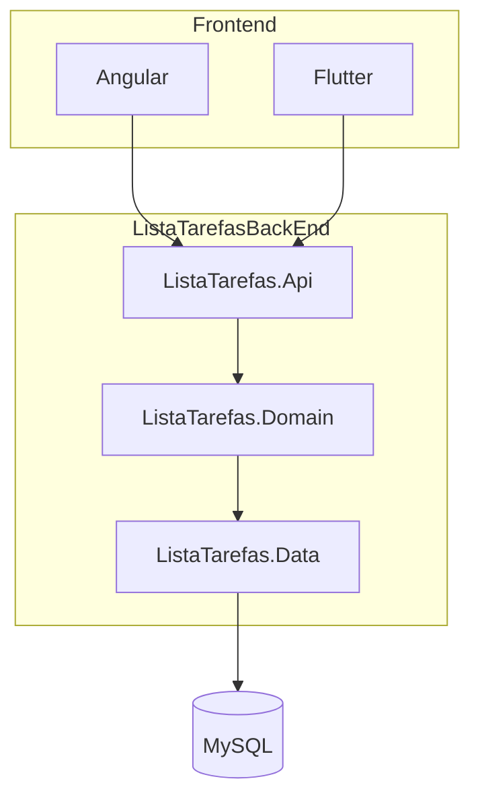

# ListaTarefas

Aplicação full stack para gerenciamento de tarefas, com API REST em ASP.NET Core, persistência em MySQL e dois clientes web: **Angular** e **Flutter**.


## Funcionalidades

- Autenticação via **JWT** (login com e-mail e senha)
- CRUD de tarefas (criar, listar, editar e excluir)
- Marcação de tarefas como concluídas ou pendentes
- Filtros na listagem: por status (completa/incompleta) e por intervalo de datas de vencimento
- Documentação interativa da API com **Swagger** (ambiente de desenvolvimento)
- Validação de regras de negócio com **FluentValidation**

## Tecnologias

| Camada | Tecnologias |
|--------|-------------|
| **API** | ASP.NET Core 5.0, JWT Bearer, Swagger |
| **Domínio** | FluentValidation, padrão de notificações |
| **Dados** | Entity Framework Core 5, MySQL, Dapper |
| **Front-end Web** | Angular 12, Bootstrap, ngx-toastr |
| **Front-end Mobile/Web** | Flutter 3.x, HTTP, SharedPreferences |

## Arquitetura

O backend segue uma arquitetura em camadas:



### Estrutura do repositório

```
ListaTarefas/
├── ListaTarefasBackEnd/
│   ├── ListaTarefas.sln
│   ├── ListaTarefas.Api/          # Controllers, Startup, configuração JWT/Swagger
│   ├── ListaTarefas.Domain/       # Entidades, serviços, validações, interfaces
│   └── ListaTarefas.Data/         # DbContext, repositórios, migrations
└── ListaTarefasFrontEnd/
    ├── angular/lista-tarefas/     # SPA Angular
    └── flutter/lista_tarefas/     # App Flutter (web, mobile, desktop)
```

## Pré-requisitos

- [.NET 5 SDK](https://dotnet.microsoft.com/download/dotnet/5.0)
- [MySQL](https://www.mysql.com/) (servidor local ou remoto)
- [Node.js](https://nodejs.org/) (recomendado LTS) — para o front Angular
- [Flutter SDK](https://docs.flutter.dev/get-started/install) — para o app Flutter
- Visual Studio 2022 ou VS Code (opcional)

## Configuração

### 1. Banco de dados

Crie o banco de dados no MySQL (o nome padrão usado na configuração é `applistatarefas`):

```sql
CREATE DATABASE applistatarefas CHARACTER SET utf8mb4 COLLATE utf8mb4_unicode_ci;
```

### 2. Connection string e JWT

Edite o arquivo `ListaTarefasBackEnd/ListaTarefas.Api/appsettings.json` (ou use [User Secrets](https://learn.microsoft.com/aspnet/core/security/app-secrets) em desenvolvimento):

```json
{
  "ConnectionStrings": {
    "MyConnection": "server=localhost;user=SEU_USUARIO;password=SUA_SENHA;database=applistatarefas;port=3306;"
  },
  "AppSettings": {
    "Secret": "SUA_CHAVE_SECRETA_JWT",
    "Audience": "VsAudience",
    "Issuer": "VsIssuer",
    "Seconds": 86400
  }
}
```

> **Importante:** não commite senhas ou segredos reais no repositório. Prefira variáveis de ambiente ou User Secrets.

As migrations do Entity Framework são aplicadas automaticamente na inicialização da API.

### 3. Usuário padrão (seed)

Após rodar as migrations, existe um usuário inicial para testes:

| Campo | Valor |
|-------|-------|
| E-mail | `root` |
| Senha | `1234` |

Altere ou remova esse usuário em ambientes de produção.

## Como executar

### Backend (API)

```bash
cd ListaTarefasBackEnd/ListaTarefas.Api
dotnet restore
dotnet run
```

URLs padrão:

| Ambiente | URL |
|----------|-----|
| HTTP | http://localhost:5000 |
| HTTPS | https://localhost:5001 |
| Swagger | https://localhost:5001/swagger |

### Front-end Angular

```bash
cd ListaTarefasFrontEnd/angular/lista-tarefas
npm install
npm start
```

Acesse: http://localhost:4200

A URL da API está em `src/environments/environment.ts`:

```typescript
apiUrl: 'https://localhost:5001/api/'
```

### Front-end Flutter

```bash
cd ListaTarefasFrontEnd/flutter/lista_tarefas
flutter pub get
flutter run
```

A base da API está configurada em `lib/services/http_service_base.dart` (`https://localhost:5001/api/`). Ajuste conforme a porta em que a API estiver rodando.

> Para desenvolvimento local com HTTPS autoassinado, pode ser necessário confiar no certificado de desenvolvimento do .NET (`dotnet dev-certs https --trust`).

## API REST

Todas as rotas de tarefas exigem autenticação JWT, exceto o login.

### Autenticação

| Método | Rota | Descrição |
|--------|------|-----------|
| `POST` | `/api/Auth/Logar` | Autentica o usuário e retorna o token JWT |

**Corpo da requisição:**

```json
{
  "email": "root",
  "password": "1234"
}
```

**Resposta (exemplo):**

```json
{
  "id": 1,
  "email": "root",
  "acessToken": "<token_jwt>"
}
```

Envie o token no header das demais requisições:

```
Authorization: Bearer <token_jwt>
```

### Tarefas

| Método | Rota | Descrição |
|--------|------|-----------|
| `POST` | `/api/Tarefa/AdicionarAsync` | Cria uma nova tarefa |
| `PUT` | `/api/Tarefa/AtualizarAsync` | Atualiza uma tarefa existente |
| `PUT` | `/api/Tarefa/ApagarAsync/{tarefaId}` | Remove uma tarefa |
| `GET` | `/api/Tarefa/ObterPorIdAsync/{tarefaId}` | Busca tarefa por ID |
| `GET` | `/api/Tarefa/ObterListaAsync` | Lista tarefas com filtros opcionais |

**Query parameters da listagem:**

| Parâmetro | Tipo | Descrição |
|-----------|------|-----------|
| `completa` | `bool` | Filtra tarefas concluídas |
| `incompleta` | `bool` | Filtra tarefas pendentes |
| `datainicio` | `DateTime` | Data inicial do vencimento |
| `datafim` | `DateTime` | Data final do vencimento |

**Modelo da entidade Tarefa:**

| Campo | Tipo | Descrição |
|-------|------|-----------|
| `id` | `int` | Identificador |
| `titulo` | `string` | Título da tarefa |
| `descricao` | `string` | Descrição |
| `dataVencimento` | `DateTime?` | Data de vencimento |
| `completa` | `bool` | Indica se está concluída |

## Rotas do front-end Angular

| Rota | Componente | Descrição |
|------|------------|-----------|
| `/` ou `/login` | Login | Tela de autenticação |
| `/task-list` | TaskList | Listagem de tarefas |
| `/task-form` | TaskForm | Cadastro de nova tarefa |
| `/task-form-edit/:id` | TaskFormEdit | Edição de tarefa |
| `/task-list-mock` | TaskListMock | Listagem mock (desenvolvimento) |

## Migrations

Para criar ou aplicar migrations manualmente:

```bash
cd ListaTarefasBackEnd/ListaTarefas.Api
dotnet ef migrations add NomeDaMigration --project ../ListaTarefas.Data
dotnet ef database update --project ../ListaTarefas.Data
```

## Contribuindo

1. Faça um fork do projeto
2. Crie uma branch para sua feature (`git checkout -b feature/minha-feature`)
3. Commit suas alterações (`git commit -m 'Adiciona minha feature'`)
4. Push para a branch (`git push origin feature/minha-feature`)
5. Abra um Pull Request

## Licença

Este projeto não possui licença definida no repositório. Consulte o autor antes de usar em produção ou redistribuir.
